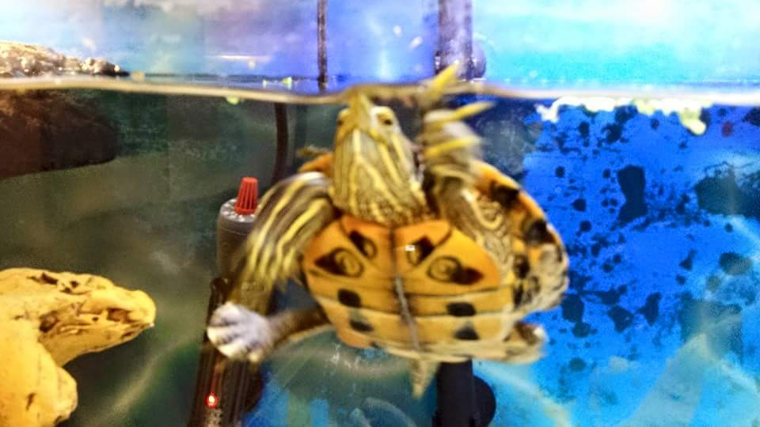

# Wilson Cam
Capture an image from a webcam and upload to Dropbox.

## About
This project is named after Wilson, a red-eared slider turtle adopted from [Little RES Q](http://littleresq.net/) several years ago. I currently use it to take pictures of my pet turtle.

## Equipment
All components used are older versions and can easily be replaced by something newer.

**NOTE**: Since I only have a small memory card, the system boot happens using the memory card with BerryBoot, and the operating system is mounted from the USB drive.

### Hardware
- [Raspberry Pi 1 Model B](https://www.raspberrypi.org/products/model-b/)
- 512MB SD Card
- 8GB USB Flash Drive
- [TP-LINK TL-WN725N](http://www.tp-link.com/lk/products/details/cat-11_TL-WN725N.html) (wireless USB adapter)
- [Microsoft Lifecam VX-3000](https://www.microsoft.com/hardware/en-ca/d/lifecam-vx-3000) (webcam)
- USB Hub

### Software
- [BerryBoot](http://www.berryterminal.com/doku.php/berryboot)
- [Debian Jessie Raspbian](https://www.raspberrypi.org/downloads/raspbian/)
- [Dropbox](https://www.dropbox.com/)

## Setup
1. Using your computer, install BerryBoot onto the SD Card (see http://www.berryterminal.com/doku.php/berryboot)
1. Assemble the Raspberry Pi and power on
  1. Place SD Card in slot
  1. Plug the USB drive in one USB slot
  1. Plug the USB hub into the other USB slot
  1. Connect any additional USB devices into the hub (e.g. keyboard, mouse, webcam, wifi adapter)
  1. Connect a monitor with a HDMI cable
  1. Connect to the internet with an ethernet cable
  1. Connect to power
1. Install Jessie Raspbian to the USB drive using BerryBoot
1. Configure wireless adapter to connect to wifi so that a wired connection is not necessary
1. `git clone https://github.com/ravangen/Wilson-Cam.git` this repository and `cd Wilson-Cam`
1. Install python package dependencies: `pip install -r requirements.txt`
1. Create a Dropbox app at https://www.dropbox.com/developers/apps/create using the "Dropbox API", "App Folder" access type, and an app name of your choice
1. Open this new Dropbox app and generate a OAuth 2 access token to be used to upload the image
